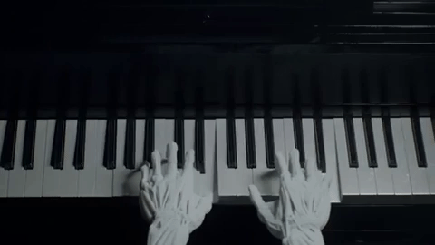

# Algorithmic Music Composition


Grammar-based midi music-file generation using Python 3, with some additional libraries.

## Motivation
One of the best ways of understanding something better is to teach it to someone. This has been popularized as the Feynman Technique. 
Teaching a computer (in a rule-based, grammar approach) is a challenging, but fun and rigorous method of doing so.
It provides an excellent opportunity to reinforce clean coding practices, since there is a lot of complexity and layers of abstraction present within the hidden structure of music.

## Implementation
This is the fundamental library which powers [Virtual Bard](http://virtualbard.com), a set of tools I've made for creating music.
The backend of that (with some additional help from Flask plumbing) is hosted and run on Google Cloud Platform (GCP).

## Python Version used

3.7.7

### Prerequisites

What you need to install and how to install them

```
pip install midiutil
pip install statistics
```

The standard Python libraries of `math` and `sys` are also used. 

## Running the program

Eventually there will be a web interface for the program.
For now, this is how you run it:

```
python generate_music.py
```
Doing so will generate a midi file in the current directory, by default named `song.mid`.
To tinker around with the song-generation settings, the best way to do so is to modify `hand_motions.py` and `Presets` in `generate_music.py`.

## Author

**Ivan Viro**
